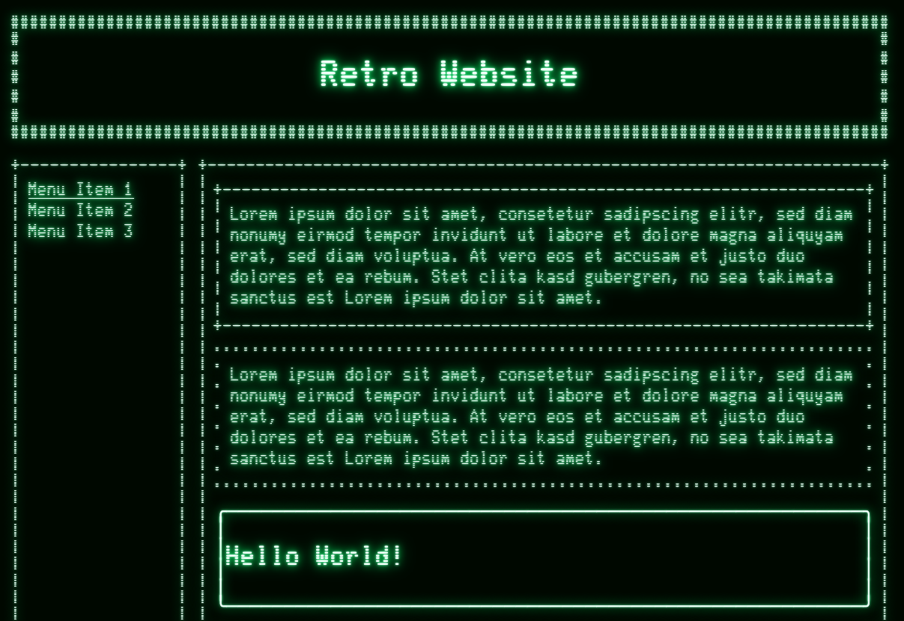

# Retro Terminal Engine

A lightweight JavaScript library that renders retro-style ASCII art borders around HTML elements using a `<canvas>` overlay. Inspired by old CRT monitors and terminal aesthetics, it gives websites a nostalgic green-on-black phosphor display look.

## Preview




## How It Works

The engine operates in three stages:

1. **Element Discovery** — On page load, the engine scans the DOM for elements marked with the `retro-render` attribute.

2. **Layout Adjustment** — For each marked element, it calculates the exact padding needed to accommodate the border characters, then applies `margin` and `padding` via inline styles so the content doesn't overlap the drawn borders.

3. **Canvas Rendering** — A fixed `<canvas>` element sits behind the page content (`z-index: -1`). The engine draws the borders by repeatedly printing the chosen border characters (horizontal, vertical, and corner pieces) onto the canvas, positioned to align with each element's computed layout. A dual-layer glow effect (a tight inner glow and a wider outer glow) creates the CRT phosphor bloom.

Two rendering modes are supported:
- **Full mode** — The canvas covers the entire document height. On scroll, the canvas is translated via CSS `transform` to stay aligned with the viewport.
- **Viewport mode** — When the document exceeds 4096px in any dimension, the canvas is sized to the viewport only and re-rendered on each scroll event.

## Project Structure

```
retro_engine/
├── index.html          # Main page with example usage
├── css/
│   └── global.css      # Retro terminal styling and form element theming
├── js/
│   └── bundle.js       # RetroEngine class — the core library
└── fonts/
    ├── Glass_TTY_VT220.woff
    └── Glass_TTY_VT220.woff2
```

## Quick Start

Include the three files in your HTML page:

```html
<link rel="stylesheet" href="css/global.css">
<script defer src="js/bundle.js"></script>
<canvas id="retro-engine"></canvas>
```

Then add the `retro-render` attribute to any element you want a border drawn around:

```html
<div retro-render retro-border="single">
    <p>This box will get a retro border.</p>
</div>
```

## Border Styles

Use the `retro-border` attribute to pick a built-in style:

| Style     | Preview              |
|-----------|----------------------|
| `single`  | `+--------+`         |
| `double`  | `+========+`         |
| `heavy`   | `██████████`         |
| `box`     | `┌────────┐`         |
| `dbox`    | `╔════════╗`         |
| `round`   | `╭────────╮`         |
| `diamond` | `◆◇◆◇◆◆`         |
| `slant`   | `/\/\/\/\/\/`        |
| `dot`     | `· · · · · ·`        |
| `hash`    | `##########`         |
| `chain`   | `╭────────╮`         |
| `arrow`   | `◄────────►`         |

## Custom Borders

Override individual characters with dedicated attributes:

```html
<div retro-render retro-h="~" retro-v="|" retro-tl="<<" retro-tr=">>" retro-bl="<<" retro-br=">>">
    <p>Custom border style.</p>
</div>
```

The attributes are:
- `retro-h` — horizontal character
- `retro-v` — vertical character
- `retro-tl` — top-left corner
- `retro-tr` — top-right corner
- `retro-bl` — bottom-left corner
- `retro-br` — bottom-right corner

## API

```js
const engine = new RetroEngine(canvas_id);
```

Creates a new engine instance bound to the canvas element with the given ID.

```js
const found = engine.init(attribute);
```

Scans the DOM for elements with the given attribute (e.g., `"retro-render"`). Returns `true` if at least one matching element is found.

```js
engine.render();
```

Clears the canvas and redraws all borders for the currently discovered elements.

```js
engine.stopLoop();
```

Cleans up observers and timers. Call this when tearing down the engine.

## CSS Theming

The `global.css` file provides a complete retro terminal theme. Key colors:

| Token       | Value     | Purpose              |
|-------------|-----------|----------------------|
| `#0a0a0a`   | Background| Page background      |
| `#000800`   | Input BG  | Dark green input fill|
| `#f0fff8`   | Text      | Primary text color   |
| `#00ff66`   | Glow      | CRT phosphor glow    |
| `#80ffc0`   | Inner glow| Tight highlight      |

Adjust these values in `global.css` to change the color scheme. The canvas glow is hardcoded in `bundle.js` at the `render()` method (`shadowColor` and `shadowBlur`), and can be changed there.

## Browser Support

Requires a browser with:
- Canvas 2D context
- `ResizeObserver`
- `devicePixelRatio` support
- Web font loading (`document.fonts.ready`)

This covers all modern browsers (Chrome, Firefox, Safari, Edge).
